# React Js Base Structure

## 1. Introduction

This document outlines the structure, requirements, necessary technologies, and setup.

## 2. Use Case & Feature

-   This application is used for the admin panel
-   Image Croping Using react-image-crop library
-   CRUD Operations
-   File Uploading on server (File Management)
-   Add / Edit Form Validation and Error handling using formik & Yup library
-   Role Permission Management Based on Role and Permission action will be displayed

## 3. Technologies

-   React 18.2.0
-   Tailwind
-   Graphql

## 4. Libraries Used

**Note: Mentioned only the major packages.**

| Name                | Use Case                                                                                                                                                                                                                       |
| ------------------- | ------------------------------------------------------------------------------------------------------------------------------------------------------------------------------------------------------------------------------ |
| @apollo/client      | Apollo Client is a fully-featured caching GraphQL client with integrations for React, Angular, and more. It allows you to easily build UI components that fetch data via GraphQL. https://www.npmjs.com/package/@apollo/client |
| crypto-js           | crypto-js is Used for the encrypt and decrypt the data. https://www.npmjs.com/package/crypto-js                                                                                                                                |
| formik              | Handling the form it's field, validation, error messages. https://www.npmjs.com/package/formik                                                                                                                                 |
| graphql             | The JavaScript reference implementation for GraphQL, a query language for APIs created by Facebook. https://www.npmjs.com/package/graphql                                                                                      |
| husky               | Husky is used for the pre-commit and pre-push any action perform in git. https://www.npmjs.com/package/husky                                                                                                                   |
| i18next             | This package is used for the translation a text in different different language. https://www.npmjs.com/package/i18next                                                                                                         |
| jodit-react-ts      | This package is used for the Editor text box related. https://www.npmjs.com/package/jodit-react-ts                                                                                                                             |
| moment              | Used for the Data and Time Conversion. https://www.npmjs.com/package/moment                                                                                                                                                    |
| primereact          | PrimeReact is a rich set of open source UI Components for React. https://www.npmjs.com/package/primereact                                                                                                                      |
| react-checkbox-tree | Checkbox Tree view display. https://www.npmjs.com/package/react-checkbox-tree                                                                                                                                                  |
| react-image-crop    | Image cropping component. https://www.npmjs.com/package/react-image-crop                                                                                                                                                       |
| react-toastify      | Display the Toaster message like, success, error, warning. https://www.npmjs.com/package/react-toastify                                                                                                                        |
| yup                 | Form Validation. https://www.npmjs.com/package/yup                                                                                                                                                                             |
| tailwindcss         | Used for a designing a components. https://www.npmjs.com/package/tailwindcss                                                                                                                                                   |
| mapbox-gl-draw      | Provides features to draw points, lines, and polygons on the map, as well as edit existing features. https://www.npmjs.com/package/@mapbox/mapbox-gl-draw                                                                                                                        |
| react-google-maps/api     | Used to integrate Google Maps in application. https://www.npmjs.com/package/@react-google-maps/api                                                                                                                       |
| stripe/react-stripe-js    |  Used to get a set of React components that you can be used to create custom payment forms and handle payment processing with Stripe. https://www.npmjs.com/package/@stripe/react-stripe-js                                                                                                                      |
| stripe/stripe-js    |  Used to securely collect and tokenize payment information from customers. https://www.npmjs.com/package/@stripe/stripe-js                                                                                                                      |
| stripe/stripe-js    |  Used to get the component like loadStripe,PaymentIntentResult,StripeError to integrate stripe payment. https://www.npmjs.com/package/stripe                                                                                                                      |

## 5. Project Setup

To run this project locally, follow these steps:

-   `Node Version : (>=20.11.0)`

-   `NPM Version : (>=10.2.4)`

1. Clone the repository using the link: [Repository Link](https://BrainvireInfo@dev.azure.com/BrainvireInfo/NodeJS%20Base%20Structure/_git/reactjs-base-structure)

2. Navigate to the project folder:

    `cd reactjs-base-structure`

3. Create a `.env` file:

    `Add Below Credentails and api end points in .env file`

    - REACT_APP_API_GATEWAY_URL=XXXXXXXXXXXXXX
    - REACT_APP_API_IMAGE_URL=XXXXXXXXXXXXXX
    - REACT_APP_ENCRYPTION_DECRYPTION_KEY=XXXXXXXXXXXXXX
    - REACT_APP_API_BASENODE=XXXXXXXXXXXXXX

4. Install the dependencies:

    `npm install`

5. Start the development server:

    `npm run start`

    - Visit http://localhost:3000 to view the project.

6. Build for production:

    `npm run build`

    Build will generate a build folder

## 6. Project Structure

-   **Overall structure:**
    <br>
    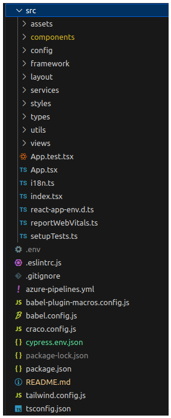

<br><br>

-   **Subfolder structure:**
    <br>

| Folder             | Structure                                    | Description                                                                                                                                      |
| ------------------ | -------------------------------------------- | ------------------------------------------------------------------------------------------------------------------------------------------------ |
| src/...            | 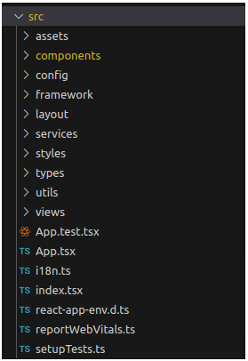               | - This folder contains all the necessary files and folders such as common components, assets,fonts,hooks,configurations,pages etc.               |
| src/assets/...     | 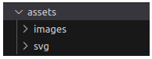         | - This folder contains fonts and images, Icons that are used throughout the application.                                                         |
| src/components/... | 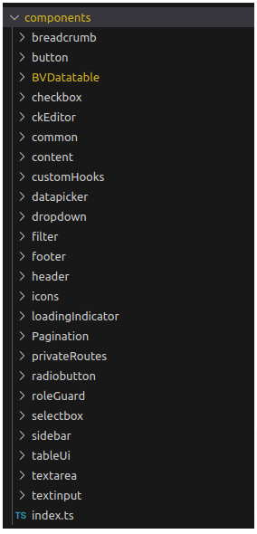 | - This folder structure contains all the common components and the configurator components that are designed for code reusablity and efficiency. |
| src/config/...     | 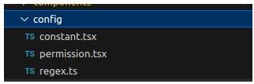         | - This folder contains a constant variable, permissions, regular common expression                                                               |
| src/framework/...  | 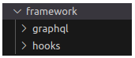  | - This Folder contains a graphqls                                                                                                                |
| src/layout/...     | 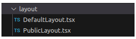         | - This folder contains a default and public layout                                                                                               |
| src/services/...   | 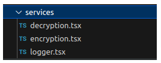     | - This Folder contain a encyption and decryption functions related files                                                                         |
| src/styles/...     | 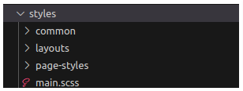         | - This folder contains a scss and other css related files                                                                                        |
| src/types/...      | 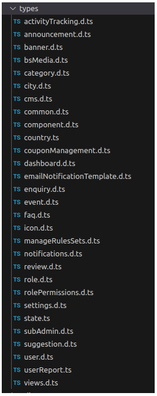           | - This folder contains a Interface and Types                                                                                                     |
| src/utils/...      | 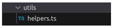           | - This Folder includes a common re-usable custom functions                                                                                       |
| sre/views/....     | 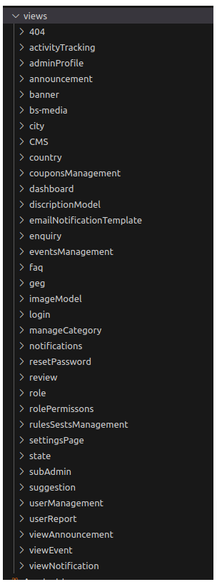           | - This Folder contains a Each common CRUD Operation components                                                                                   |

<br><br>

## 7. Component Management:

-   **Common Components** :-

    -   To separate functionality and make code more understandable, reusable, and manageable, we construct components for each functionality,

-   **Component Creation** :-
    -   First you need to create a new folder inside a views folder and need to make a component inside that component folder and always you need to take care about the component is re-usable.

### 8. Common Datatables Components

-   refere path to check it's use cases and how to use
    -   `src/components/BVDatatable/README.md`

### 9. Refer below component for the CRUD Operation

-   `src/views/banner` refer this component to create listing, add, edit, update, delete

### 10. Stable Branch

-   FE_DESIGN_MODULES

### 11. Compability

-   Chrome, Firefox, Brave, Safari

### 12. Demo link with Credentails

```
- Link: https://basereact18.demo.brainvire.dev/
- Credentials
    Email: amit.shah@brainvire.com
    Password: Brain@1234
```

### 13. Sonarqube
- Link: https://sonarqube.brainvire.com/dashboard?branch=FE_DESIGN_MODULES&id=NodeJS-Base-Structure-sonarqube 